# 🪙 Sistema de Subastas en Tiempo Real

Sistema de subastas en tiempo real utilizando **React + Vite**, **json-server con SSE**, **Zustand** y **MUI**.
Este sistema permite:

* Crear y gestionar subastas con productos.  
* Realizar ofertas y recibir actualizaciones en tiempo real mediante **Server-Sent Events (SSE)**.  
* Visualizar historial de pujas con estilo chat y estado ganador/perdedor.  
* Soporte para usuarios con roles **admin** y **compradores**.  
* UI responsive, limpia y moderna.  
* Separación de lógica en hooks y servicios para escalabilidad.  
* Manejo de errores global con **ErrorBoundary** y fallback amigable.

---

##  Instalación

### Requisitos

- **Node.js >= 20.x**
- **npm >= 10.x**
- **Git instalado**

Verificar con:

```bash
node -v
npm -v
git --version
```

### Clonar el repositorio

```bash
git@github.com:ZeinTonconi/Final-Project-Auction-System.git
cd Final-Project-Auction-System
```

### Instalación de dependencias

#### Frontend

```bash
npm install
```

#### Backend (json-server con SSE)

```bash
cd sse
npm install
```

---

## Ejecución

### Backend (json-server + SSE)
Desde la carpeta directorio del proyecto entrar a sse:

```bash
cd sse
node server.js
```
Levanta el backend en `http://localhost:3000` con SSE en `/events`.
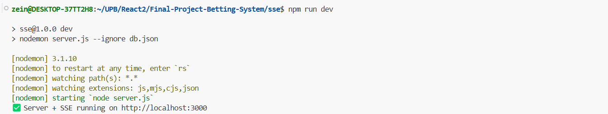

### Frontend

En otra terminal:

```bash
npm run dev
```

Levanta el frontend en `http://localhost:5173`.

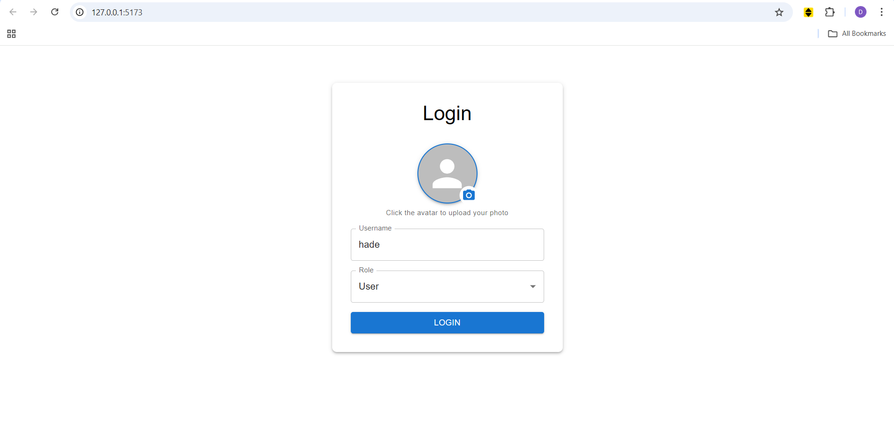

## Scripts 

- `npm run dev`: Modo desarrollo.
- `npm run dev` (en `/sse`): Ejecuta el backend.

## Aplicacion
### Login
En cuanto abre la aplicacion en el navegador se vera la pantalla de login, donde puede ingresar su usuario y el role. 

### Dashboard
Luego de presionar el login lo madara al Dashboard donde se mostrara todas las subastas, en curso, futuras y pasadas. Dependiendo si el usuario es administrador o no mostrara mas opciones para la administracion de las subastas.
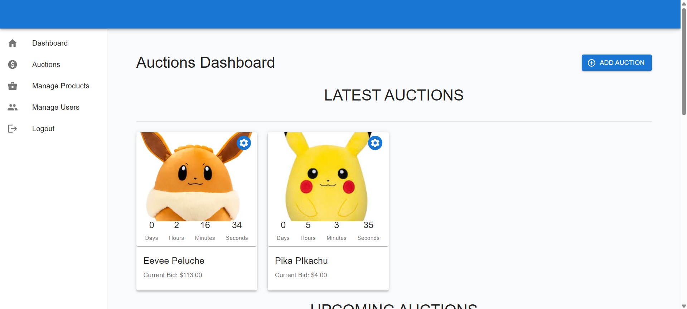
Para crear una nueva subasta se puede presionar en el boton de Add Auction. Se abrira un formulario donde puede ingresar el producto y el tiempo que quiere que la subasta sea vigente. Ademas de mostrar un preview de como se vera la subasta para el usuario.
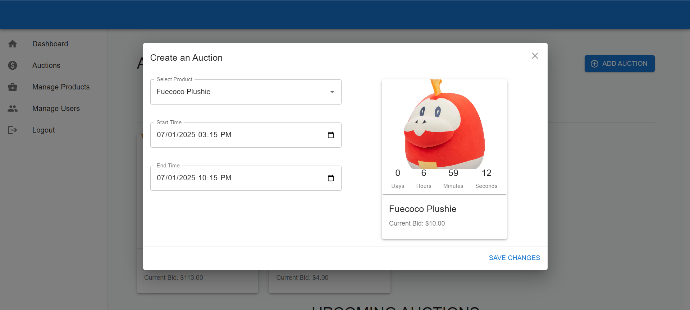
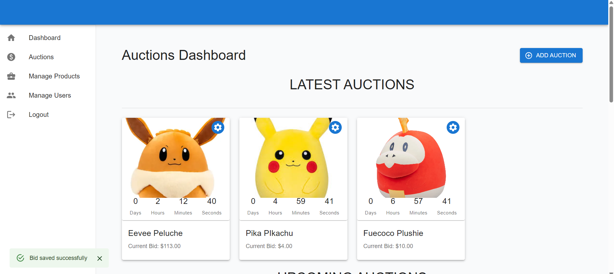
Dentro de cada subasta existe un boton de configuracion que muestran las opciones disponibles. 
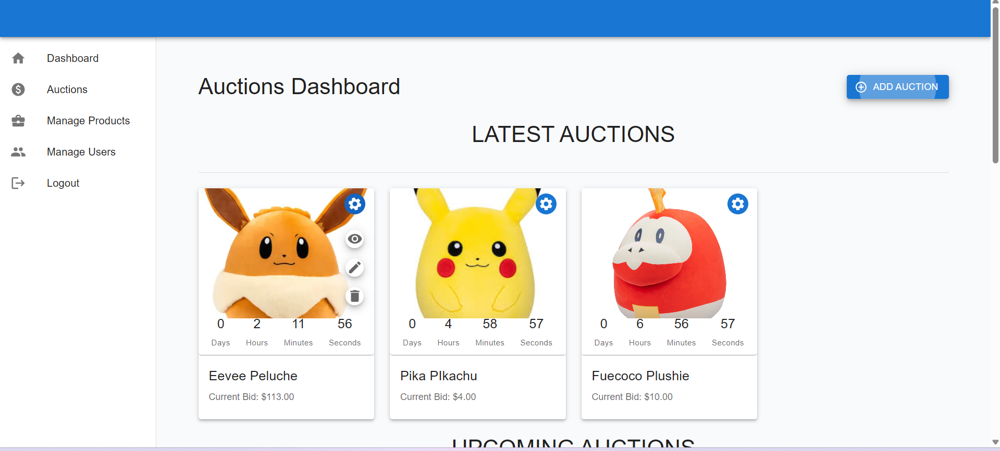
Se puede:
* Editar (icono del lapiz): se abrira el formulario con los datos para editar
* Eliminar (icono del basurero): con este se podra elimnar las subastas
* Ver (icono del ojo): se mostrara mas informacion sobre el producto y sobre la subasta. Esta opcion tambien esta disponible para el usuario con role user para que pueda participar de la subasta.
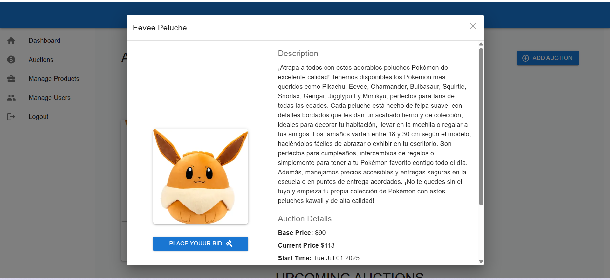 
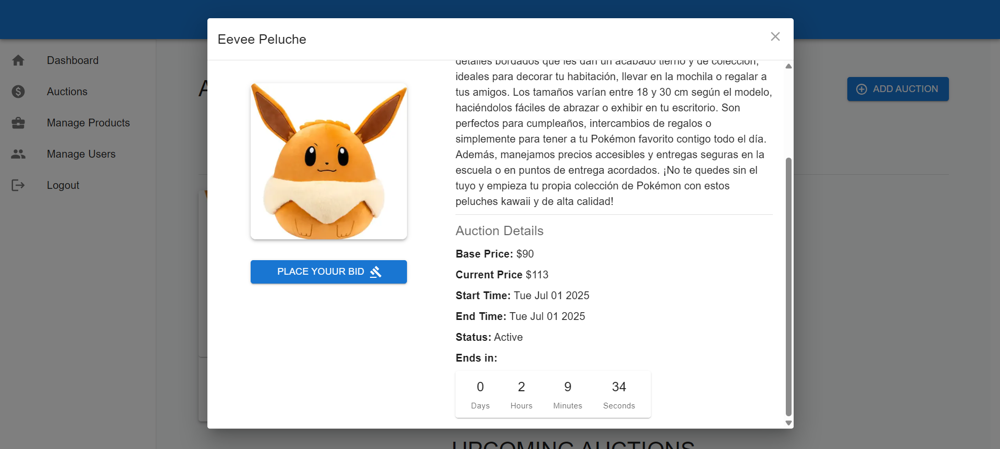
## Administrador de Productos
Al hacer click en la opcion Manage Products dentro del sidebar, se mostrara una tabla con todos los productos creados y que pueden participar dentro de alguna subasta.
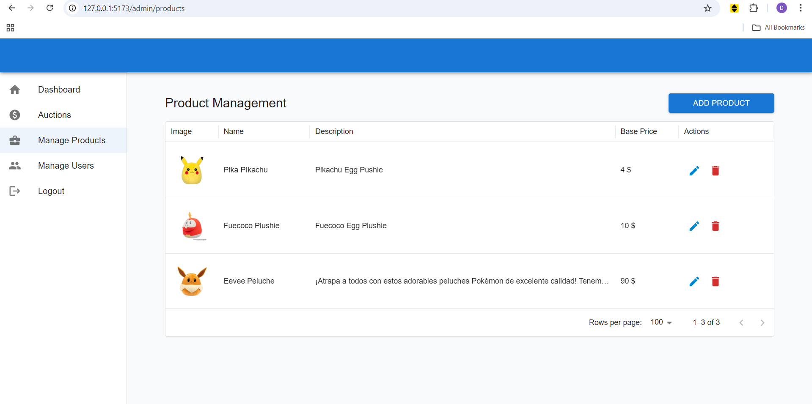
Para crear un producto se debe hacer click en Add Product, donde podra ingresar todos los datos del nuevo producto
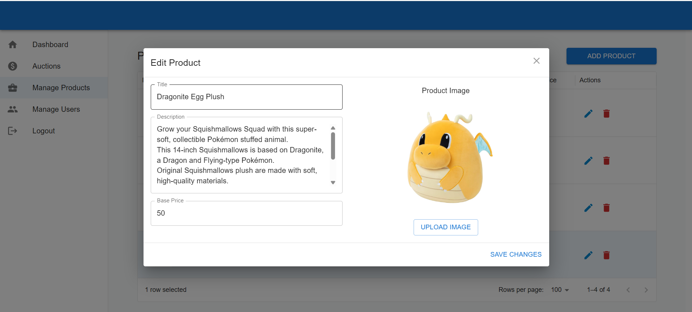
Igualmente para editar o eliminar se puede presionar en su respectiva fila y accion.
## Administrador de Usuarios
En esta pagina se muestran todos los usuarios junto con su username, nombre, avatar y role
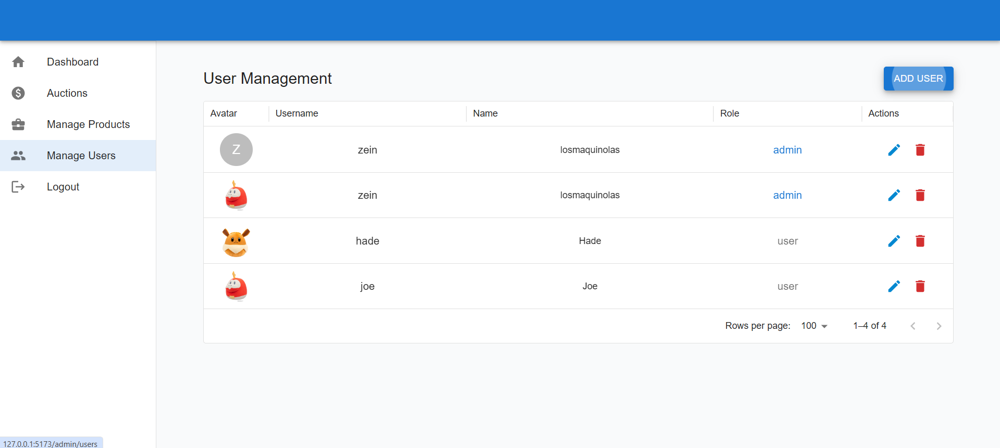
## Pagina de subasta
Cuando al momento de ver los detalles de un producto dentro del dashboard se presiona el boton de Place Your Bid lo mandara a una pagina exclusiva de la subasta
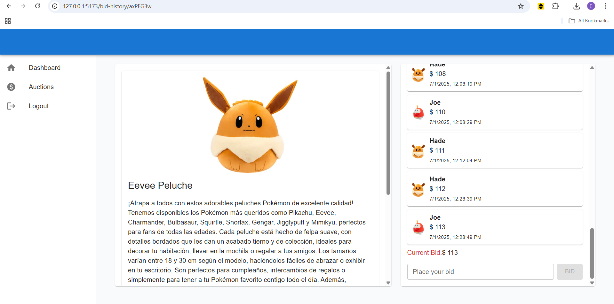
Donde esta los detalles del producto y un historial de las pujas de los usuarios. Si la subasta aun esta en curso el usuario puede colocar su oferta sin embargo el numero debe ser mayor a la puja actual. 
## Aspectos Tecnicos
* **Uso de useCallback y useMemo**: dentro del hook useProductBidHistory se filtraba el producto, las subastas y las pujas que corresponden al producto. No obstante si estas listas son muy grandes hacer el calculo de estos datos seran muy costosos es por eso que utilizo useMemo. Y tambien se usa el useCallback para las funciones de accion de cada card de subasta dentro de useDashboard por su uso frecuente.
* **Uso de context**: Se utilizo un contexto para guardar la sesion del usuario
* **Zustand**: Se utilizo zustand para guardar los productos y asi cada vez que se modifique la lista de productos no haya la necesidad de volver a llamar al backend. Tambien se utilizo para guardar las subastas y las pujas.
* **i18n**: Tambien se utilizo el i18n para la internacionalizacion.